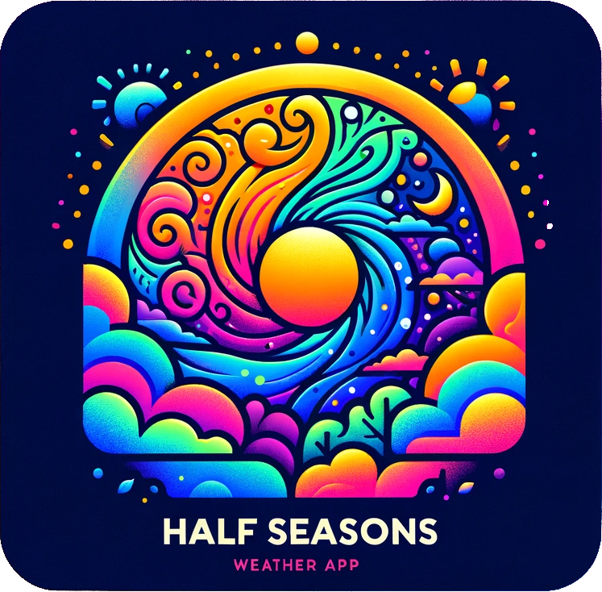

# Mezze-Seasons

  

## FS0723 D5W2U3

Benvenuti in Mezze-Seasons, un'applicazione meteorologica progettata per fornire informazioni meteorologiche accurate e aggiornate. Con Mezze-Seasons, puoi rimanere informato sulle condizioni meteorologiche nella tua zona e pianificare le tue attività di conseguenza. Esercizio realizzato durante il corso fulltstack di EPICODE. Grazie Casasola, sei stato un grande tutor :)

## Funzionalità

- **React**: Mezze-Seasons è costruita utilizzando React, una popolare libreria JavaScript per la creazione di interfacce utente.
- **Bootstrap-react**: Utilizziamo Bootstrap-react per garantire un design responsive e visivamente accattivante su diversi dispositivi e dimensioni dello schermo.
- **react-router-dom**: Con react-router-dom, Mezze-Seasons offre una navigazione senza soluzione di continuità aggiornando il componente principale in base alle coordinate fornite nell'url creato dinamicamente dai Link component.
- **OpenWeather Map API**: Mezze-Seasons si integra con l'API di OpenWeather Map per recuperare dati meteorologici in tempo reale da tutto il mondo.
- **Leaflet OpenStreetMap**: Ho usato Leaflet OpenStreetMap per ottenere facilmente l'input dell'utente per la ricerca di località

## Funzionamento componenti

- La dashboard principale chiede all'utente di usare la posizione gps per iniziare a istanziare una prima homepage. Se la posizione non è disponibile, si apre un modale per una prima posizione. Se non si immette una prima posizione, la dashboard va in errore. La dashboard da informazione dettagliate sulle condizioni meteo delle prossime 24 ore della posizione immessa.
- La navbar permette di tornare in home e visualizza un'anteprima del meteo sempre l'ultima posizione con input dalla dashboard e aprire la mappa per cercare nuove posizioni.
- La zona "Le tue Località" carica le ultime 5 posizioni date in input salvate nel localstorage
- In "Alte località" sono presenti una lista di località suggerite per dare varietà e tutte le posizioni precedenti immesse dall'utente

## Dipendenze

1. React-router-dom
2. React-bootstra
3. Leaflet
4. OpenWeather Map API

